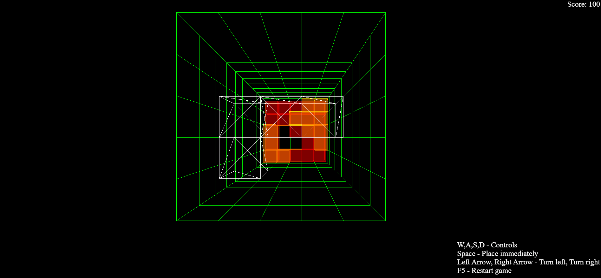

# Block Fall 3D - Webowa gra zręcznościowa

Trójwymiarowa adaptacja klasycznej gry zręcznościowej z 1984 roku, stworzona przy użyciu technologii Three.js oraz Vite. Projekt przenosi tradycyjne mechaniki układania bloków w przestrzeń 3D, oferując graczowi świeże spojrzenie na sprawdzoną rozgrywkę.

> [!IMPORTANT]
> ### Wersja demonstracyjna na żywo (Live Demo)
> Przetestuj działającą aplikację: **[adikungen.github.io](https://adikungen.github.io/Projekt_IAM_Budny_Adrian_PAW3/)**
>
> *Opis sterowania znajduje się w prawym dolnym rogu aplikacji oraz w sekcji [Sterowanie w grze](#sterowanie-w-grze)*

---

## O projekcie
Projekt został wykonany w ramach zajęć „Interaktywne aplikacje multimedialne” na semestrze letnim 2023/2024, studiów pierwszego stopnia.

Projekt powstał jako nowoczesna reinterpretacja legendarnej gry komputerowej o układaniu bloków stworzonej przez Aleksieja Pażytnowa. Podczas gdy większość współczesnych wariantów ogranicza się do tradycyjnej, dwuwymiarowej planszy, niniejsza aplikacja wzbogaca mechanikę o trzeci wymiar.

Dodatkowa oś przestrzenna wprowadza zupełnie nową dynamikę i zwiększa poziom trudności, zmuszając gracza do planowania ruchów w siatce $5 \times 12 \times 5$. Całość opiera się na lekkim, przeglądarkowym silniku 3D z intuicyjnym interfejsem użytkownika i płynną mechaniką kolizji.

---

## Kluczowe funkcjonalności

*   **Trójwymiarowa plansza gry:** Przestrzeń o wymiarach $5 \times 12 \times 5$ ograniczona przejrzystymi, siatkowymi ścianami ułatwiającymi orientację przestrzenną.
*   **Pula różnorodnych klocków 3D:** Losowe generowanie zdefiniowanych figur (m.in. Cube, J, L, Square, I, S, Z, T).
*   **Wielokierunkowe sterowanie:**
    *   Ruch w płaszczyźnie poziomej (osie $X$ i $Z$).
    *   Obrót brył wokół osi pionowej (o kąt $\frac{\pi}{2}$).
    *   Natychmiastowe zrzucenie klocka na dno lub na wcześniej ułożone elementy.
*   **Dynamiczna kolorystyka warstw:** Automatyczna zmiana koloru klocków po ułożeniu w zależności od wysokości warstwy (indeksu $Y$).
*   **Mechanika punktowania i usuwania warstw:** Detekcja całkowicie zapełnionych płaszczyzn, usuwanie warstwy, opuszczanie elementów położonych wyżej oraz przyznawanie punktów.
*   **Progresywny poziom trudności:** Stopniowe zwiększanie prędkości opadania klocków wraz z każdą wyczyszczoną warstwą.
*   **Detekcja końca gry:** Automatyczne zatrzymanie rozgrywki po przekroczeniu krytycznej wysokości planszy.

---

## Demo / Prezentacja działania

Poniższa animacja przedstawia pełny cykl rozgrywki w aplikacji: od generowania bloków w siatce $5 \times 12 \times 5$, przez dynamiczne manewrowanie klockami w przestrzeni trójwymiarowej (rotacje, translacje oraz natychmiastowe opuszczanie tzw. hard drop), aż po detekcję kolizji, mechanizm czyszczenia wypełnionych warstw wraz z aktualizacją punktacji. Dodatkowo w trakcie prezentacji zilustrowano zachowanie silnika gry w sytuacjach granicznych (np. blokowanie niepoprawnych ruchów poza granice siatki), co demonstruje poprawność zaimplementowanego modelu kolizji i stabilność pętli renderowania.

<p align="center">
  
</p>

---

## Technologie i narzędzia

* **Grafika 3D / WebGL:** [Three.js](https://threejs.org/) (renderowanie sceny 3D, oświetlenie, siatka geometrii, dynamiczne materiały i ramki bloków)
* **Frontend:** HTML5, CSS3, JavaScript (ES6+ Modules)
* **Narzędzie deweloperskie / Bundler:** [Vite](https://vitejs.dev/) (Hot Module Replacement, szybki dev-server, modularność kodu)
* **Zarządzanie zależnościami:** [npm](https://www.npmjs.com/) (zarządzanie pakietami i skryptami projektu)

---

## Instrukcja instalacji i uruchomienia

### Wymagania

*   Zainstalowane środowisko [Node.js](https://nodejs.org/) (wersja 16.x lub nowsza).
*   Menedżer pakietów **npm** (dołączony do Node.js).
*   Nowoczesna przeglądarka internetowa ze wsparciem dla WebGL.

### Instrukcja

1.  **Sklonuj repozytorium:**
    ```bash
    git clone https://github.com/AdiKungen/Projekt_IAM_Budny_Adrian_PAW3.git
    cd Projekt_IAM_Budny_Adrian_PAW3
    ```

2.  **Zainstaluj zależności:**
    ```bash
    npm install
    ```

3.  **Uruchom serwer deweloperski:**
    ```bash
    npm run dev
    ```
    Otwórz w przeglądarce adres wskazany w konsoli (domyślnie `http://localhost:5173/Projekt_IAM_Budny_Adrian_PAW3/`).

### Sterowanie w grze

| Klawisz | Akcja |
| :--- | :--- |
| <kbd>W</kbd> | Przesunięcie klocka w głąb planszy ($-Z$) |
| <kbd>S</kbd> | Przesunięcie klocka ku przodowi ($+Z$) |
| <kbd>A</kbd> | Przesunięcie w lewo ($-X$) |
| <kbd>D</kbd> | Przesunięcie w prawo ($+X$) |
| <kbd>←</kbd> (Strzałka w lewo) | Obrót w lewo wokół osi $Y$ |
| <kbd>→</kbd> (Strzałka w prawo) | Obrót w prawo wokół osi $Y$ |
| <kbd>Spacja</kbd> | Natychmiastowe upuszczenie bloku na spód |
| <kbd>F5</kbd> | Restart gry |

---

## Podziękowania / Credits

* Projekt został zainspirowany klasyczną grą logiczną z 1984 roku stworzoną przez Aleksieja Pażytnowa.

---

## Zastrzeżenie / Disclaimer

**PL:**  
Ten projekt jest niekomercyjnym projektem edukacyjnym/portfolio, inspirowanym klasycznymi grami logicznymi polegającymi na układaniu spadających bloków. Tetris® jest zastrzeżonym znakiem towarowym firmy The Tetris Company. Ten projekt nie jest powiązany ani sponsorowany przez The Tetris Company.

**EN:**  
This project is a non-commercial educational/portfolio project inspired by classic falling block puzzle games. Tetris® is a registered trademark of The Tetris Company. This project is neither affiliated with nor endorsed by The Tetris Company

---

## Licencja / License

**PL:**  
Copyright (c) 2026 Adrian Budny. Wszelkie prawa zastrzeżone.  
Kod źródłowy tego projektu udostępniony jest wyłącznie do wglądu w celach demonstracji portfolio i weryfikacji umiejętności. Kopiowanie, modyfikowanie, rozpowszechnianie lub wykorzystywanie tego kodu w celach komercyjnych lub prywatnych bez pisemnej zgody autora jest zabronione.

**EN:**  
Copyright (c) 2026 Adrian Budny. All rights reserved.  
This source code is made publicly available solely for portfolio demonstration and technical evaluation. No permission is granted to copy, modify, distribute, or use this code for any commercial or non-commercial purpose without prior written consent from the author.
